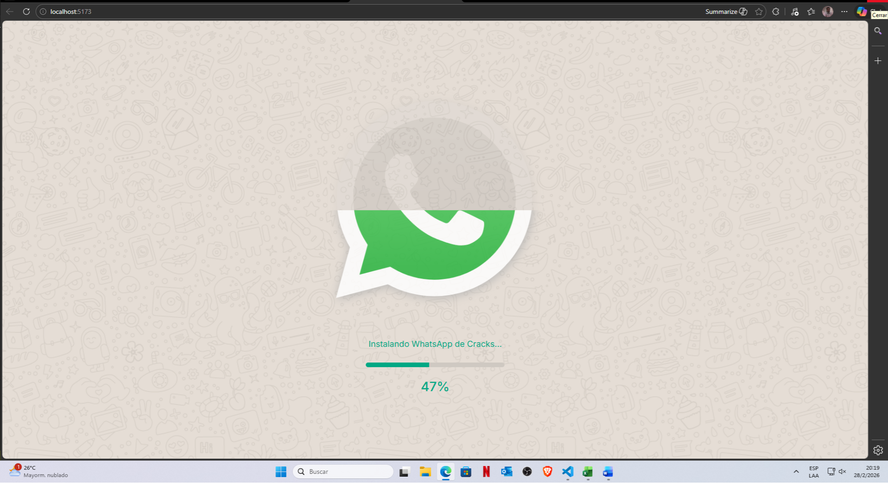
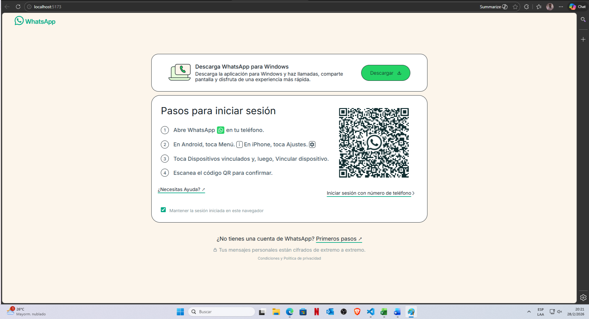
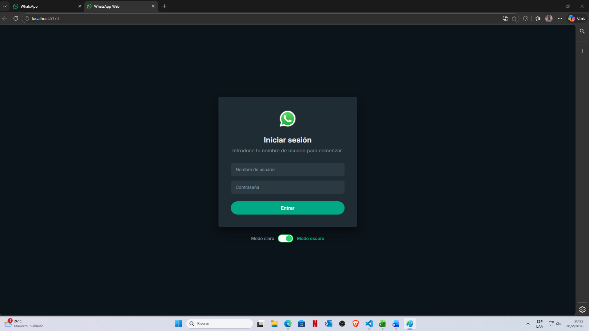
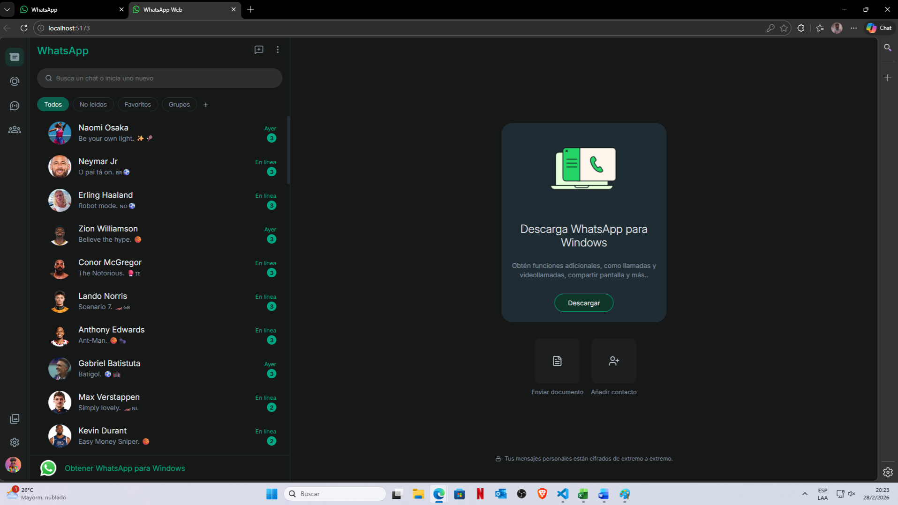

WhatsApp Web Clone — TP Final Frontend
Clon funcional de WhatsApp Web con IA integrada, sistema de temas dinámico y simulación de ecosistema completo.
🚀 Ver Deploy en Vercel · 📂 Repositorio GitHub · 🌐 Demo en Vivo
________________________________________
Descripción del Proyecto

WhatsApp Web Clone es una aplicación de alto nivel que replica la experiencia visual y funcional de la plataforma original. Construida en React, utiliza una arquitectura moderna basada en contextos y enrutamiento dinámico para gestionar un flujo de usuario complejo que incluye desde pantallas de carga hasta chats inteligentes con 50 deportistas famosos.

## Demo y Screenshots

<div align="center">
  <table style="width: 100%; border: none;">
    <tr>
      <td align="center" width="50%">
        <kbd>
          
        </kbd>
        <p><b>1. Bienvenida y Carga</b><br>Simulación de descarga con barra de progreso progresiva.</p>
      </td>
      <td align="center" width="50%">
        <kbd>
          
        </kbd>
        <p><b>2. Conexión QR</b><br>Interfaz de vinculación con links activos a soporte y descarga.</p>
      </td>
    </tr>
    <tr>
      <td align="center" width="50%">
        <kbd>
          
        </kbd>
        <p><b>3. Autenticación</b><br>Ingreso de usuario y selector de tema (Claro/Oscuro).</p>
      </td>
      <td align="center" width="50%">
        <kbd>
          
        </kbd>
        <p><b>4. Panel de Chat</b><br>IA integrada con deportistas y detección de intenciones.</p>
      </td>
    </tr>
  </table>
</div>

Demo en Video
<div align="center">
  <video src="./public/images/Screenshots/VideoDemo.mp4" width="100%" controls muted>
    Tu navegador no admite el elemento de video.
  </video>
  <p><i>Interacción con la IA.</i></p>
</div>
________________________________________
Flujo de Usuario y Pantallas

1. Pantalla de Bienvenida (Splash)
•	Experiencia inmersiva: Pantalla de carga con doodles de fondo antes de acceder al sistema.
•	Simulación de inicio: Efecto visual de llenado con barra de carga progresiva y logo animado.

2. Conexión por QR
•	Simulación de Sincronización: Interfaz interactiva de WhatsApp Web Sync.
•	Acceso a Recursos Externos: Botones y links 100% operativos:
o	Descargar App
o	¿Necesitas ayuda? ↗
o	Primeros pasos ↗

3. Autenticación y Preferencias
•	Formulario de Login: Captura de nombre de usuario y contraseña (validación flexible para demo).
•	Personalización: Selector de Modo Claro / Oscuro que redefine la estética de toda la App mediante variables CSS antes de montar los chats.
________________________________________
Funcionalidades Principales

Sistema de Chat con IA
•	Motor de IA (Groq): Integración con Llama 3.3 70B. Los 50 deportistas (Messi, Ronaldo, Hamilton, etc.) responden con su personalidad real y en voseo rioplatense.
•	Detección de Intenciones: El chat identifica y formatea automáticamente:
    o	Emails, Fechas, Teléfonos, Adjuntos y URLs.
•	Interactividad: Panel de emoticones, ticks de mensaje (Enviado/Leído) y scroll automático.

Sidebar y Filtros Activos
•	Gestión de Contactos: * Botón "Todos" y "No leídos" con filtrado en tiempo real.
    o	Favoritos: Sección funcional (lista vacía por defecto).
    o	Añadir Contactos: Menú activo para expandir la agenda.
•	Ordenamiento Dinámico: Los chats con mensajes no leídos se posicionan automáticamente en la parte superior.

Estados y Multimedia
•	Estados con Video: 7 deportistas con clips de YouTube y barra de progreso animada.
•	Lógica de "Visto": El borde del estado cambia de verde (nuevo) a gris (visto) tras visualizar la historia.
•	Multimedia: Panel activo de visualización de archivos.

Nav Rail (Navegación Lateral)
Icono	Panel	Estado	Descripción
🗨	Chats	    ✅	Navegación entre hilos de conversación.
👁	Estados	    ✅	Historias con video y detección de visualización.
📢	Canales	    ✅	Visualización de noticias deportivas (solo vista).
👥	Comunidades	✅	Panel estático de grupos masivos (solo vista).
🖼	Multimedia	 ✅	Galería de archivos compartidos (solo vista).
⚙️	Ajustes	    ✅	Temas, Apariencia y Exportar/Importar chats.
👤	Perfil	    ✅	Visualización de información del usuario.
________________________________________
Tecnologías y Librerías

Core	React 18, Vite, React Router DOM 6
Estilos	CSS Variables (Temas Dinámicos), CSS Modules, Lucide React
IA & API	Groq Cloud (Llama 3.3), YouTube Embed API
Deploy	Vercel (CI/CD Automático)
________________________________________
Arquitectura del Proyecto

El proyecto utiliza Context API para centralizar la lógica en dos grandes pilares:
1.	ChatContext: Maneja el estado global de mensajes, la lógica de la IA y el contador de no leídos.
2.	ThemeContext: Controla los 5 presets de color y el toggle Global Claro/Oscuro mediante la manipulación de :root.

```
└── 📁public
    └── 📁avatar
        ├── avatar.avif
    └── 📁images
        ├── avatar.avif
        ├── claro-sports.jpg
        ├── community-dark.png
        ├── community-light.png
        ├── Doodles-oscuro.jpg
        ├── Doodles-oscuro.png
        ├── espn.jpg
        ├── F1.enc
        ├── fifa.jpg
        ├── icono-menu.png
        ├── logo-ft.png
        ├── moto-gp.jpg
        ├── nba.jpg
        ├── pc-phone-light.png
        ├── pc-phone.png
        ├── qr-whatsapp.png
        ├── tyc.enc
        ├── wa.png
        ├── wa2.png
    └── vite.svg
```

```
└── 📁src
    └── 📁assets
        ├── react.svg
    └── 📁components
        └── 📁chat
            ├── AddContactPanel.jsx
            ├── ChatWindow.jsx
            ├── CountrySelector.jsx
            ├── NavRail.jsx
        └── 📁conmon
            ├── ArchiveIcon.jsx
            ├── ChannelIcon.jsx
            ├── ChatIcon.jsx
            ├── ComunityIcon.jsx
            ├── ContactIcon.jsx
            ├── FavoritesIlustration.jsx
            ├── LoadingScreen.jsx
            ├── MultimediaIcon.jsx
            ├── NavIconButton.jsx
            ├── SettingsIcon.jsx
            ├── StatusIcon.jsx
            ├── UserIcon.jsx
    └── 📁context
        ├── ChatContext.jsx
        ├── ThemeContext.jsx
    └── 📁data
        ├── ContactItem.jsx
        ├── contactsData.jsx
        ├── countries.js
        ├── initialMessages.js
        ├── MainLayout.js
    └── 📁features
        └── 📁backup
            ├── BackupPanel.jsx
        └── 📁smart-hints
            ├── SmartHints.jsx
        └── 📁theme
            ├── ThemePanel.jsx
    └── 📁Screens
        ├── ChatPage.jsx
        ├── ContactScreen.jsx
        ├── LoadingScreen.jsx
        ├── Login.jsx
        ├── ProfileScreen.jsx
        ├── Sidebar.jsx
        ├── StatusScreen.jsx
        ├── WelcomeScreen.jsx
        ├── WhatsAppLogin.jsx
    └── 📁styles
        ├── AddContactPanel.css
        ├── App.css
        ├── BackupPanel.css
        ├── ChatWindow.css
        ├── ContactScreen.css
        ├── emoji-additions.css
        ├── index.css
        ├── LoadingScreen.css
        ├── Login.css
        ├── Sidebar.css
        ├── SmartHints.css
        ├── StatusScreen.css
        ├── ThemePanel.css
        ├── variables.css
        ├── WelcomeScreen.css
        ├── WhatsAppLogin.css
    ├── App.jsx
    ├── main.jsx
    ├── README.md
    └── vercel.json
```
________________________________________
Cumplimiento de Requisitos

| Despliegue en Vercel | ✅ | CI/CD automático desde rama `main` |
| Código en GitHub | ✅ | Repositorio público |
| README.md | ✅ | Este documento |
| Responsivo 320px–2000px | ✅ | CSS Grid + Flexbox + media queries |
| Estilos accesibles | ✅ | Contraste WCAG AA, paleta oficial WhatsApp |
| Desarrollado en React | ✅ | React 18 con hooks modernos |
| Uso de estados | ✅ | `useState` en todos los componentes interactivos |
| Uso de contextos | ✅ | `ChatContext` (mensajes, IA, no leídos) + `ThemeContext` (temas) |
| React Router DOM | ✅ | Rutas: `/`, `/loading`, `/chat`, `/chat/:id_usuario` |
| Al menos 1 formulario | ✅ | LoginPage con validación y submit |
| Uso de componentes | ✅ | +15 componentes reutilizables |
| Al menos 2 páginas | ✅ | LoginPage, LoadingScreen, ChatPage |
| Parámetros de ruta | ✅ | `useParams()` en ChatPage para `id_usuario` |
| Principios DRY/YAGNI/KISS | ✅ | Helpers centralizados, sin código duplicado |
________________________________________
Dificultades y Soluciones

•	Límites de API: Se migró de Gemini a Groq para garantizar respuestas rápidas y sin límites de cuota diarios para la demo.
•	Identificación de Contactos: Se implementaron IDs numéricos para evitar errores de encoding con nombres de deportistas con tildes.
•	Sincronización de Estados: Se utilizó un sistema de seguimiento de IDs vistos para alternar las clases de CSS del anillo de historias.
________________________________________
Autor

Fernando Delgado Estudiante de Frontend — UTN Facultad Regional Buenos Aires
________________________________________
TP Final — Curso de Frontend Desarrollado con ❤️ y más de 160 horas de ☕

