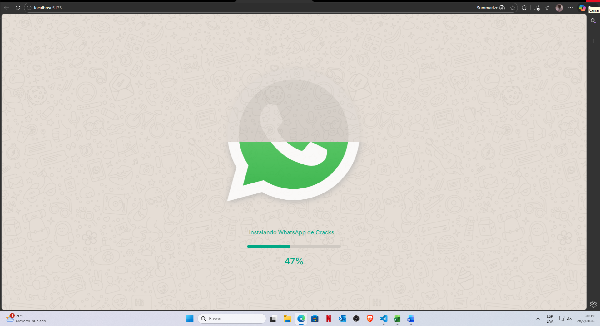
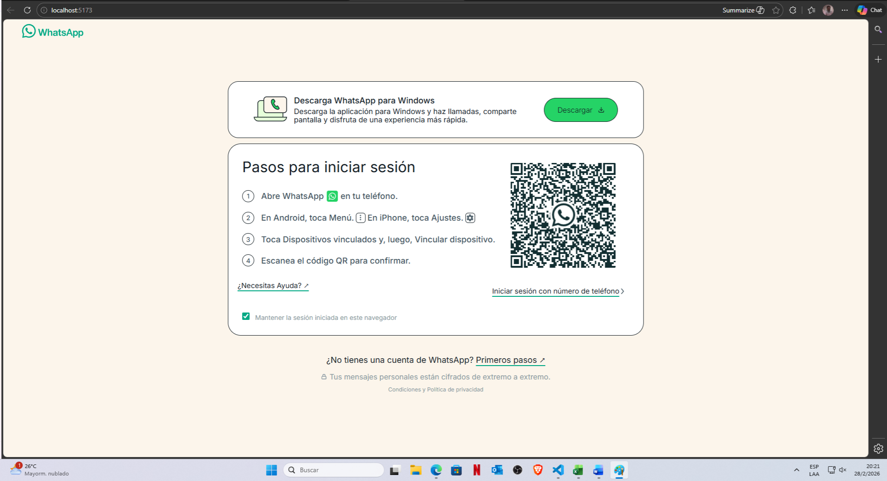
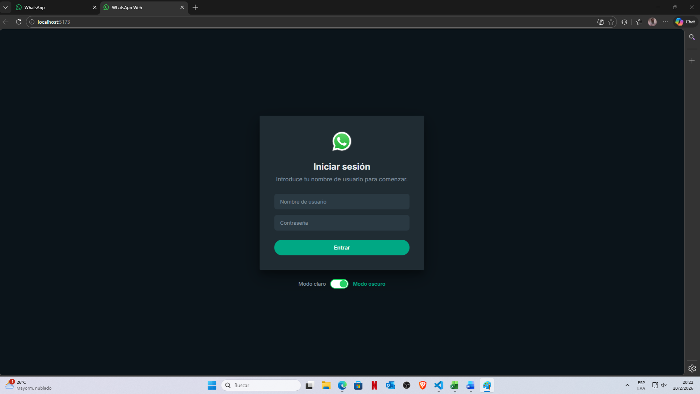
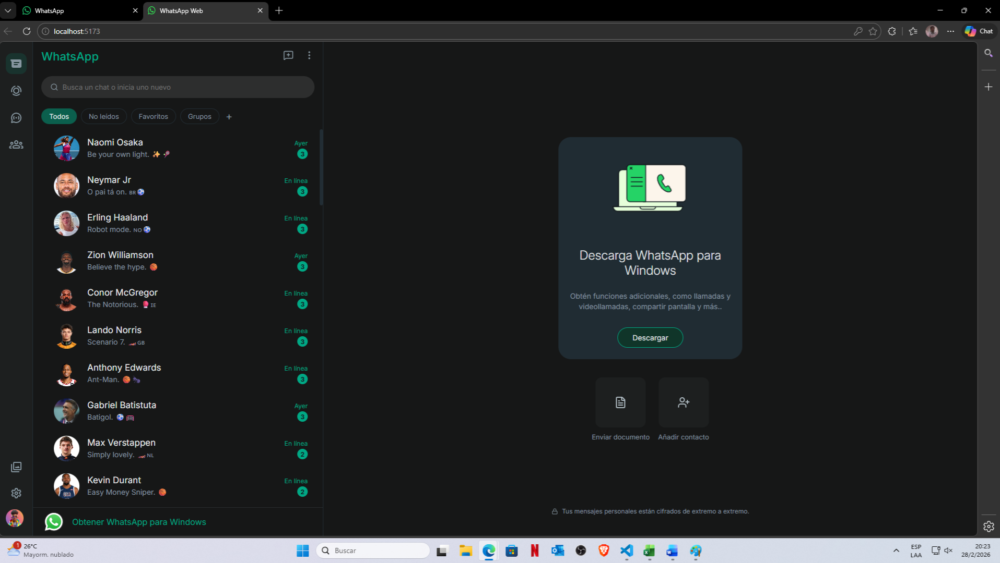

# CracksApp — TP Final Frontend

Cliente web en **React** de CracksApp: una app de mensajería instantánea con **12 deportistas de elite** que responden con IA. El frontend consume la **API REST del backend** (Node + Express + MongoDB): autenticación con JWT, mensajes persistidos y respuestas de IA generadas en el servidor.

🚀 Deploy en Vercel · 📂 Repositorio GitHub · 🌐 Demo en Vivo

________________________________________
## Descripción del Proyecto

CracksApp replica la experiencia visual de un cliente de mensajería web moderno y la conecta a un **backend propio**. Construida en React con una arquitectura basada en contextos, una **capa de servicios** que habla con la API y enrutamiento dinámico, gestiona el flujo completo: desde la pantalla de carga y el login hasta los chats con los cracks.

A diferencia de una maqueta estática, las funciones centrales son **reales y están respaldadas por el backend**: registro con verificación por email, login con JWT, contactos, mensajería privada y grupal, y las respuestas de IA —que se generan en el servidor, de modo que la API key nunca llega al navegador—.

## Demo y Screenshots

<div align="center">
  <table style="width: 100%; border: none;">
    <tr>
      <td align="center" width="50%">
        <kbd>
          
        </kbd>
        <p><b>1. Bienvenida y Carga</b><br>Pantalla de carga con barra de progreso.</p>
      </td>
      <td align="center" width="50%">
        <kbd>
          
        </kbd>
        <p><b>2. Vinculación</b><br>Pantalla de inicio con acceso al login.</p>
      </td>
    </tr>
    <tr>
      <td align="center" width="50%">
        <kbd>
          
        </kbd>
        <p><b>3. Autenticación</b><br>Registro / login real (JWT) y selector de tema.</p>
      </td>
      <td align="center" width="50%">
        <kbd>
          
        </kbd>
        <p><b>4. Panel de Chat</b><br>Chats con los cracks, IA generada en el backend.</p>
      </td>
    </tr>
  </table>
</div>

<div align="center">
  <a href="https://youtu.be/h1XztaPgLeo">
    
  </a>
  <p><i>▶ Click para ver demo — Interacción con la IA</i></p>
</div>

________________________________________
## Flujo de Usuario y Pantallas

**1. Pantalla de Bienvenida (Splash)**
- Pantalla de carga con doodles de fondo y barra de progreso animada antes de acceder al sistema.

**2. Pantalla de inicio**
- Réplica visual de la vinculación, con el acceso al formulario de login.

**3. Autenticación y Preferencias**
- **Login / Registro reales:** el formulario crea la cuenta (con verificación por email) o inicia sesión contra el backend, que devuelve un **JWT**.
- **Personalización:** selector de modo Claro / Oscuro que redefine la estética de toda la app mediante variables CSS.

________________________________________
## Funcionalidades Principales

### Autenticación real (vía backend)
- Registro con **verificación por email**, login que devuelve un **JWT**, y sesión persistida. El token viaja como `Authorization: Bearer <token>` en cada pedido a la API.

### Chat con IA
- Los **12 deportistas** (Messi, Ronaldo, Hamilton, etc.) responden con su personalidad y en voseo rioplatense. La respuesta la **genera el backend** con Groq (Llama 3.3 70B); el cliente solo la pide y la muestra (la API key vive en el servidor).
- **Detección de intenciones:** el chat identifica y formatea automáticamente emails, fechas, teléfonos, adjuntos y URLs.
- **Interactividad:** panel de emojis, reacciones, ticks de mensaje (enviado/leído) y scroll automático.

### CRUD desde la interfaz
- **Contactos:** buscar y agregar usuarios, **editar** (alias) y **eliminar** desde el menú del chat.
- **Grupos:** crear, **editar** (nombre) y **eliminar**, con sus miembros.
- **Perfil:** editar nombre, estado y **foto** (se sube y se guarda en el backend).

### Personalización y extras
- Tema **claro/oscuro** + 5 presets de color (variables CSS). Exportar/importar backup de chats. Selector de emojis. Responsive de 320px a 2000px.

## Nav Rail (Navegación Lateral)

| Icono | Panel | Estado | Descripción |
|---|---|---|---|
| 🗨 | Chats | ✅ Funcional | Conversaciones privadas y grupales (datos del backend) |
| 👤 | Perfil | ✅ Funcional | Editar nombre, estado y foto |
| ⚙️ | Ajustes | ✅ Funcional | Temas, apariencia y exportar/importar |
| 👁 | Estados | 🟡 Maqueta | Reproduce la estética original; no consume la API |
| 📢 | Canales | 🟡 Maqueta | Solo vista |
| 👥 | Comunidades | 🟡 Maqueta | Solo vista |
| 🖼 | Multimedia | 🟡 Maqueta | Solo vista |

> Las secciones marcadas como **maqueta** reproducen la estética de un cliente de mensajería para dar contexto visual; las funciones centrales (auth, contactos, mensajería e IA) están conectadas al backend.

________________________________________
## Tecnologías y Librerías

| Capa | Tecnología |
|---|---|
| Core | React 19, Vite, React Router DOM 7 |
| Estilos | Variables CSS (temas dinámicos), Lucide React |
| Datos | Capa de servicios (`fetch` + Bearer JWT) que consume la API de CracksApp |
| IA | Groq (Llama 3.3 70B) — generada en el **servidor** |
| Backend | Node.js + Express + MongoDB (repositorio aparte) |
| Deploy | Vercel (CI/CD automático) |

## Arquitectura del Proyecto

El proyecto usa **Context API + una capa de servicios**:

1. **ChatContext** — estado global de contactos, grupos y mensajes; orquesta las llamadas a la API a través de la capa de servicios.
2. **ThemeContext** — los 5 presets de color y el toggle claro/oscuro mediante la manipulación de `:root`.
3. **services/** — un wrapper de `fetch` (agrega el `Bearer` y maneja errores) + un servicio por recurso (auth, users, contacts, groups, conversations).
4. **mappers/** — adaptan la forma de los datos del backend a la que consumen los componentes (si la API cambia un campo, se toca solo el mapper).

```
src/
 ├─ components/chat/   ChatWindow, GroupChatWindow, AddContactPanel, NewGroupPanel, ProfilePanel, NavRail…
 ├─ context/           ChatContext (estado + API), ThemeContext (temas)
 ├─ services/          api (fetch + Bearer) + auth / users / contacts / groups / conversations
 ├─ mappers/           adaptan los datos del backend a la vista
 ├─ Screens/           Login, Sidebar, ChatPage, LoadingScreen, WelcomeScreen…
 ├─ features/          theme, backup, smart-hints
 ├─ constants/         claves de storage y modos de UI (sin magic strings)
 ├─ config/            environment (VITE_API_URL)
 └─ styles/            variables.css (tokens) + estilos por componente
```

## Integración con el backend

- El cliente consume la **API REST de CracksApp**; la URL se configura con `VITE_API_URL`.
- **Autenticación con JWT** (`Authorization: Bearer <token>`), guardado en `localStorage`.
- Los mensajes se **persisten en el backend**; cada chat abierto se refresca por **polling** cada 4 segundos (WebSockets sería el paso siguiente para tiempo real).

________________________________________
## Cumplimiento de Requisitos (Frontend)

| Requisito | Estado | Detalle |
|---|---|---|
| Despliegue en Vercel | ✅ | CI/CD automático desde `main` |
| Código en GitHub | ✅ | Repositorio público |
| README.md | ✅ | Este documento |
| Responsivo 320px–2000px | ✅ | Flexbox + media queries con tokens CSS |
| Estilos accesibles | ✅ | HTML semántico, contraste AA, paleta coherente |
| Desarrollado en React | ✅ | React 19 con hooks modernos |
| Uso de estados | ✅ | `useState` en los componentes interactivos |
| Uso de contextos | ✅ | `ChatContext` (datos + API) + `ThemeContext` (temas) |
| React Router DOM | ✅ | Rutas: `/`, `/chat/:id_usuario`, `/group/:group_id` |
| Al menos 1 formulario | ✅ | Login / Registro con validación y submit |
| Uso de componentes | ✅ | +15 componentes reutilizables |
| Parámetros de ruta | ✅ | `useParams()` para el id de la conversación |
| Principios DRY/YAGNI/KISS | ✅ | Capa de servicios y mappers, sin código duplicado |

________________________________________
## Dificultades y Soluciones

- **API key de la IA expuesta:** la generación de respuestas se movió del cliente al **backend**, de modo que la key de Groq vive solo en el servidor y nunca llega al navegador.
- **Datos siempre frescos:** se centralizó el acceso a la API en una capa de servicios + mappers, así un cambio en la API se absorbe en un solo lugar.
- **Actualización de mensajes:** se resolvió con polling cada 4s sobre el endpoint de mensajes, simple y suficiente para el alcance del trabajo.

________________________________________
## Autor

**Fernando Delgado** — Estudiante — UTN Facultad Regional Buenos Aires

TP Final · Desarrollado con ❤️ y mucho ☕
